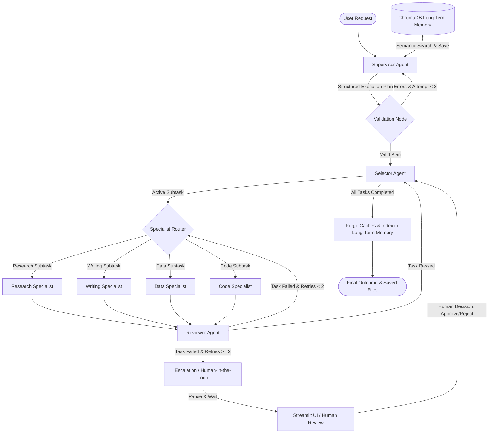
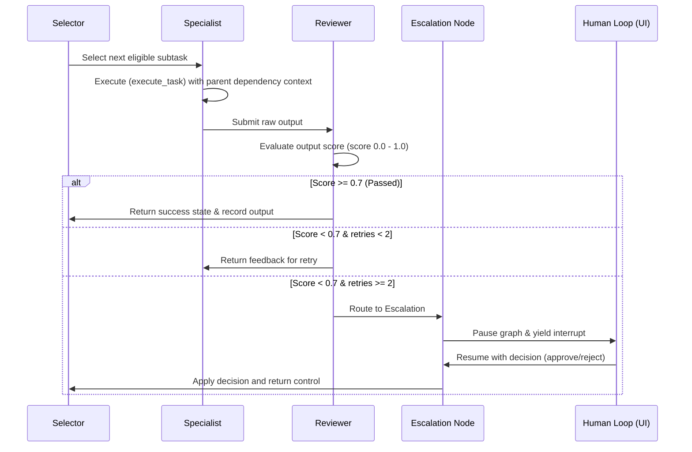
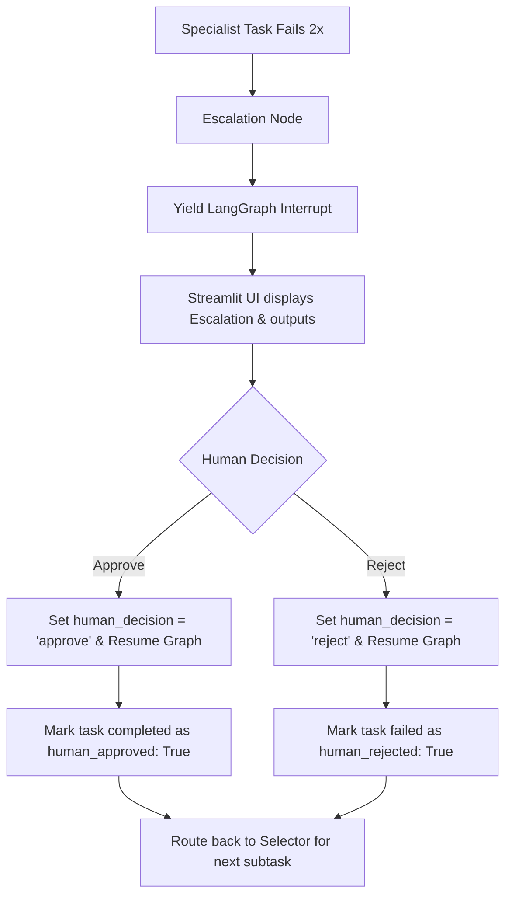
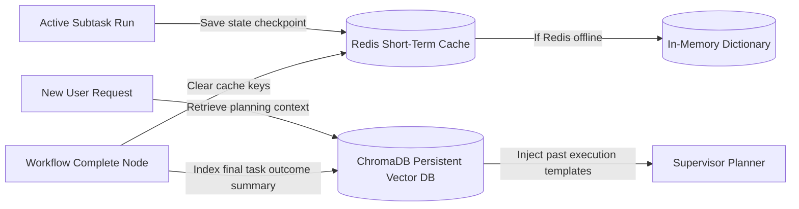
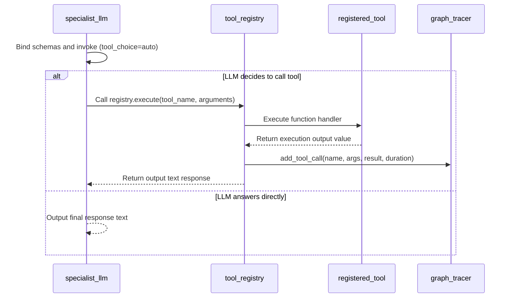

# 🤖 Agent Orchestration System (AOS)
[](https://github.com/divyyadav007/Agent-Orchestration-System-with-Tool-Use-Memory-and-Human-in-the-Loop/actions/workflows/test.yml)
[](LICENSE)
[](https://www.python.org)
[](https://github.com/psf/black)

A production-grade, stateful multi-agent orchestration architecture built on **LangGraph** featuring supervisor planning, autonomous specialist execution, automated double-loop quality review, semantic long-term memory retrieval, and human-in-the-loop escalation.

---

## 🗺️ System Overview & Architecture

The Agent Orchestration System (AOS) coordinates specialized LLM agents using a directed cyclic graph (DCG). The supervisor agent compiles a structured JSON plan for incoming requests. A selector node routes execution through specialists based on dependencies. Each specialist outcome undergoes automated verification review. If verification fails multiple times, execution halts, yielding control to an interactive human-in-the-loop dashboard.

### 1. Overall System Architecture


---

## 🌟 Key Features

* **🧠 Stateful Supervisor Planner:** Translates natural language requests into structured execution plans containing subtask IDs, descriptions, assignments, and dependency chains.
* **🤖 Specialists Agent Network:** Autonomously executes target subtasks:
  * **Research Specialist:** Generates targeted search queries and searches the web using the Tavily API.
  * **Writing Specialist:** Synthesizes information into briefs, templates, and markdown files.
  * **Data Specialist:** Executes text-based computations, transformations, and formatting.
  * **Code Specialist:** Manages workspace file writes and formatting operations.
* **🔄 Automated Double-Loop Quality Verification:** Reviewer LLM scores specialist task outputs (0.0 to 1.0) against expected metrics. Outputs scoring $< 0.7$ are sent back to the specialist with detailed correction feedback.
* **🛑 Human-in-the-Loop (HITL) Escalation:** In case of persistent failure, LangGraph's state machine issues an `interrupt` to halt graph execution, exposing task state and prompting for human approval/rejection via the Streamlit dashboard.
* **📚 Hybrid Memory Architecture:** 
  * **Short-Term Memory:** Caches in-progress state graphs in Redis (with automatic in-memory dict fallbacks).
  * **Long-Term Memory:** Semantically indexes completed tasks in a local ChromaDB vector store to inject context into the supervisor's planning phase.
* **🔍 Execution Trace Visualizer:** Captures step durations, prompts, and token counts in real time, rendering them in a console-based hierarchical tree.

---

## 📊 Workflows & Flowcharts

### 2. Specialist-Reviewer Execution Sequence


### 3. Human Approval Routing Flow


### 4. Hybrid Memory Flow


### 5. Tool Invocation Flow


---

## 🚀 Installation & Local Setup

### Prerequisites
* Python 3.11+
* Redis server (optional; fallback to in-memory dict is automatic)

### 1. Repository Setup
```bash
# Clone the repository
git clone https://github.com/divyyadav007/Agent-Orchestration-System-with-Tool-Use-Memory-and-Human-in-the-Loop.git
cd Agent-Orchestration-System-with-Tool-Use-Memory-and-Human-in-the-Loop

# Initialize and activate the virtual environment
python -m venv .venv
source .venv/bin/activate  # Windows: .venv\Scripts\activate

# Upgrade pip and install package dependencies
python -m pip install --upgrade pip
pip install -r requirements.txt
```

### 2. Environment Configuration
Copy `.env.example` to `.env` and fill in your keys:
```bash
cp .env.example .env
```

Ensure your `.env` contains:
```ini
# Groq API Configuration (Fast LLM Gateway)
GROQ_API_KEY="gsk_..."

# Tavily API Configuration (Search Specialist Engine)
TAVILY_API_KEY="tvly_..."

# LLM Selection
LLM_MODEL="llama-3.1-8b-instant"

# Memory Configuration
CHROMA_DB_PATH="./chroma_data"
REDIS_URL="redis://localhost:6379/0"
REDIS_TTL=3600
```

### 3. Running Services locally (Redis via Docker)
If you wish to use Redis locally, you can start it via Docker Compose:
```bash
docker-compose up -d redis
```

---

## 🐳 Docker Deployment

To launch the entire Agent Orchestration System in a containerized environment (Streamlit Dashboard + Redis):

```bash
# Build images and start container infrastructure
docker-compose up --build
```
The Streamlit UI will be accessible at [http://localhost:8501](http://localhost:8501).

---

## 💻 Usage & Execution Examples

### 1. Launching the Streamlit UI
```bash
streamlit run frontend/review-ui/app.py
```
Open your browser and navigate to [http://localhost:8501](http://localhost:8501).

### 2. Running Test Scripts via CLI
You can execute test scripts from the repository root directory:
```bash
# Test the graph plan compiler
python -m tests.test_graph

# Test tool execution registries
python -m tests.test_tools

# Test supervisor plan generation
python -m tests.test_supervisor

# Test long-term research specialist
python -m tests.test_research
```

---

## 📂 Project Structure

```text
├── .github/                       # GitHub Workflows & CI/CD Pipelines
│   └── workflows/                 # CI Linting and testing pipelines
│       ├── lint.yml
│       └── test.yml
├── docs/                          # Project documentation and historical reports
│   └── bug_analysis_report.md
├── examples/                      # Output artifacts and generated briefs
│   └── output/
│       ├── CEO_RamMandirScam_Brief.txt
│       └── Modi_Seychelles_brief.txt
├── frontend/                      # Streamlit UI Dashboard
│   └── review-ui/
│       └── app.py
├── src/                           # Primary Application Source Code
│   ├── core/                      # LangGraph Engine & Node Routing
│   │   ├── specialists/           # Specialist Agent Implementations
│   │   │   ├── base.py
│   │   │   ├── code.py
│   │   │   ├── data.py
│   │   │   ├── nodes.py
│   │   │   ├── research.py
│   │   │   └── writing.py
│   │   ├── graph.py
│   │   ├── human_loop.py
│   │   ├── models.py
│   │   ├── reviewer.py
│   │   ├── selector.py
│   │   └── state.py
│   ├── memory/                    # Short-term and Long-term Memory Systems
│   │   ├── long_term.py
│   │   ├── manager.py
│   │   └── short_term.py
│   ├── observability/             # Real-time Execution Tracing Callback Handlers
│   │   └── tracer.py
│   ├── tools/                     # System Tool Invocations
│   │   ├── file_io.py
│   │   ├── registry.py
│   │   └── web_search.py
│   └── utils/                     # Generic utilities (LLM interfaces, retry mechanisms)
│       └── llm.py
├── tests/                         # Test suites and runners
│   ├── test_graph.py
│   ├── test_human_loop.py
│   ├── test_orchestration.py
│   ├── test_research.py
│   ├── test_supervisor.py
│   └── test_tools.py
├── .env.example                   # Template env variables config
├── .gitignore                     # Git ignore rules
├── docker-compose.yml             # Docker multi-service configuration
├── Dockerfile                     # Streamlit container configuration
├── LICENSE                        # MIT License
├── Makefile                       # Project development shortcuts
├── requirements.txt               # Dependencies listing
└── pyproject.toml                 # Standard python metadata configurations
```

---

## 🛠️ API & Code Interfaces Documentation

### `src/tools/registry.py`
The tool registry provides a `@registry.register` decorator to dynamically register and schema-document any Python function as a runnable agent tool:

```python
from src.tools import registry

@registry.register(
    name="save_file",
    description="Save text content to a file in the workspace directory.",
    parameter_schema={
        "type": "object",
        "properties": {
            "filename": {"type": "string"},
            "content": {"type": "string"}
        },
        "required": ["filename", "content"]
    }
)
def save_file(filename: str, content: str) -> str:
    # file writing logic...
    return "Success"
```

### `src/utils/llm.py`
Initializes a chat client pointing to the Groq API gateway:
* `get_llm(model_name: Optional[str], temperature: float) -> ChatOpenAI`
* `invoke_with_retry(llm: BaseChatModel, messages: List[BaseMessage], max_retries: int) -> Any`

---

## 🛣️ Roadmap & Future Improvements

- [ ] **Dynamic Tool Registration:** Allow specialists to download or construct tool schemas during runtime.
- [ ] **Parallel Specialist Execution:** Support multi-threading in selector nodes to trigger independent tasks concurrently.
- [ ] **Local LLM Integration:** Add configurations to run Ollama for offline execution.
- [ ] **Advanced Cost & Token Tracking:** Integrate pricing trackers for usage dashboards.

---

## 📄 License

This repository is licensed under the [MIT License](LICENSE).

---

## 🙏 Acknowledgements

* [LangGraph Developers](https://github.com/langchain-ai/langgraph) for the stateful graph framework.
* [Groq Cloud Team](https://groq.com) for fast inference model endpoints.
* [Tavily](https://tavily.com) for real-time web search integrations.