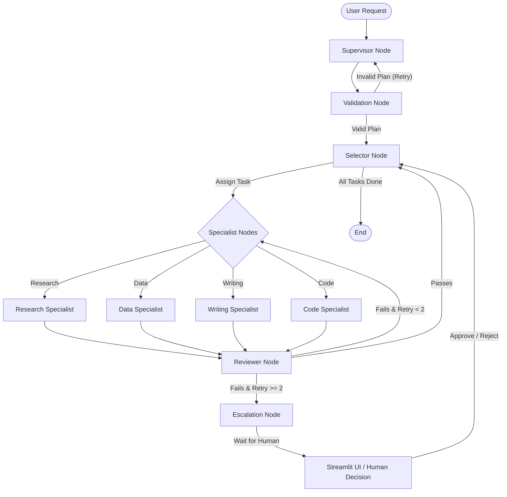

# 🤖 Agent Orchestration System

Hey everyone! This is my **Agent Orchestration System**. It's basically a team of AI agents working together to get things done. I built this using **LangGraph** to make sure different AI agents can plan their work, review their own mistakes, and even ask for human help if they get stuck. 

---

## 🗺️ How It Works (System Flow)

Here is a simple flow of how my system works behind the scenes:



---

## 🌟 Key Features

I added some really cool features to make this system smart:

- **🧠 Smart Planning (Supervisor Agent)**: When you give it a task, the Supervisor AI breaks it down into small, step-by-step instructions.
- **🤖 The AI Team (Specialists)**: I have different AI agents for different jobs:
  - **Research Specialist**: Browses the web to find the latest info.
  - **Writing Specialist**: Writes good emails, reports, or summaries.
  - **Code Specialist**: Handles saving files (like PDF or TXT files).
  - **Data Specialist**: Does calculations and handles data.
- **🔄 Auto-Reviewer**: Before showing you the final result, a Reviewer AI checks the work. If the quality is bad (score below 0.7), it tells the specialist to try again!
- **🛑 Human-in-the-Loop**: If an AI fails a task twice, it doesn't just break or give up. It pauses the whole system and asks YOU for help through the UI. You can check the mistake and click Approve or Reject.
- **📚 Memory**: It remembers past tasks using ChromaDB, so it has context of older runs.
- **💻 Simple Web Dashboard**: I built a nice Streamlit UI so you can easily run tasks, see the progress step-by-step, and download the final files directly.

---

## 🛠️ Tech Stack I Used

- **Framework**: `langgraph`, `langchain-core`
- **LLM**: `langchain-openai` (using Groq Cloud for fast models)
- **Memory**: `chromadb`, `sentence-transformers`
- **UI**: `streamlit`
- **Other stuff**: `docker`

---

## 🚀 How to Run This Project

### 1. Set up the environment
First, clone the repo and install the requirements:

```bash
git clone <your-repo-url>
cd Agent-Orchestration-System

# Create a virtual environment
python -m venv .venv
source .venv/bin/activate  # If you are on Windows, use: .venv\Scripts\activate

# Install the packages
pip install -r requirements.txt
```
*(Note: If you use `uv`, you can do `uv pip install -r requirements.txt`)*

### 2. Add your API Keys
Copy the `.env.example` file and rename it to `.env`:

```bash
cp .env.example .env
```

Then, open `.env` and add your keys:
```ini
GROQ_API_KEY="your_groq_api_key_here"
TAVILY_API_KEY="your_tavily_api_key_here"
LLM_MODEL="llama-3.1-8b-instant"
CHROMA_DB_PATH="./chroma_data"
```

### 3. Run the App!
The best way to use this is through the web dashboard:
```bash
streamlit run frontend/review-ui/app.py
```
Then just open [http://localhost:8501](http://localhost:8501) in your browser and start giving tasks to the agents!

---

## 🐳 Docker (Optional)
If you prefer Docker, you can run everything easily:
```bash
docker-compose up --build
```