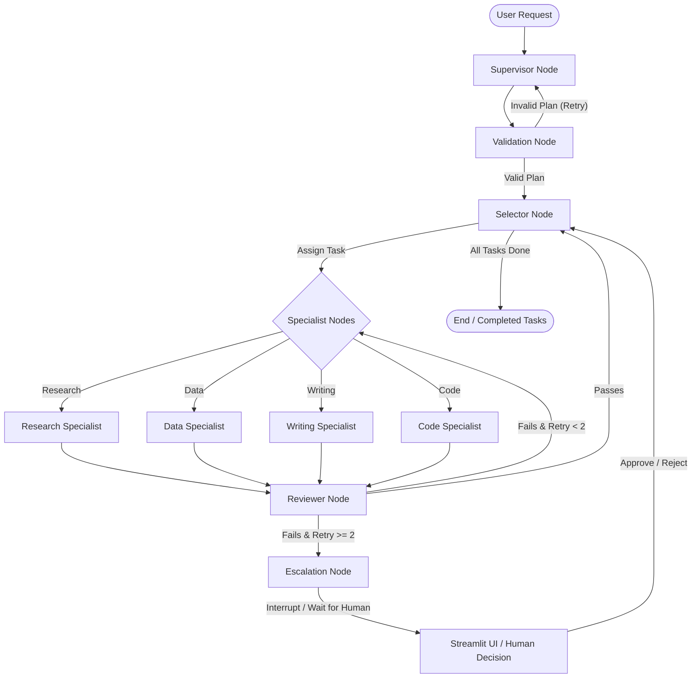

# 🤖 Agent Orchestration System

An advanced, multi-agent orchestration framework built with **LangGraph** featuring hierarchical task planning, structured outputs, self-correcting reviewer loops, human-in-the-loop escalation, vector memory integration, and a premium observability dashboard.

---

## 🗺️ System Architecture

The following diagram illustrates how state flows dynamically through the system, coordinating the Supervisor, Specialists, Reviewer, and Human Escalation loops.



---

## 🌟 Key Features

- **🧠 Hierarchical Task Planning**: The **Supervisor Agent** utilizes Pydantic structured output models (`ExecutionPlan`, `SubTask`) to parse user requests, break them down into concrete subtasks with dependencies, assign specialized agents, and map the critical path.
- **🤖 Specialized Agent Guild**: Features dedicated specialists:
  - **Research Specialist**: Uses Tavily Search API to gather external news, and structures summaries.
  - **Writing Specialist**: Synthesizes and drafts formal emails, summaries, or reports.
  - **Code Specialist**: Handles sandboxed code actions and files operations (e.g. Markdown/TXT saves).
  - **Data Specialist**: Runs calculations and database queries.
- **🔄 Auto-Reviewer & Self-Correction**: The **Reviewer Agent** critiques outputs, assigns a quality score (0.0 to 1.0), and provides feedback. If a score is below 0.7, it automatically triggers specialist retries.
- **🛑 Human-in-the-Loop (HITL) Escalation**: If a specialist's task fails twice, the graph halts using LangGraph's native `interrupt` state. Execution pauses, and the system waits for approval or rejection via the Streamlit dashboard before resuming.
- **📚 Long-Term Context Memory**: Combines **ChromaDB** with sentence-transformers (`all-MiniLM-L6-v2`) to store completed execution histories, retrieving relevant historical contexts to optimize new plans.
- **🔍 Observability Tracing**: Custom `GraphTracer` (built on LangChain callbacks) measures LLM latency, token counts, and tool durations, visualizing execution as a clean terminal tree structure.
- **💻 Premium Web Dashboard**: Streamlit-based UI displaying real-time execution steps, a stepper timeline of subtasks, download buttons for generated artifacts (TXT & FPDF-generated PDFs), and interactive human approval prompts.

---

## 🛠️ Tech Stack

- **Orchestration**: `langgraph`, `langchain-core`
- **LLM Engine**: `langchain-openai` (connected to Groq Cloud / Llama 3)
- **Vector Search & Memory**: `chromadb`, `sentence-transformers`
- **Frontend & UI**: `streamlit`, `rich`
- **Containerization**: `docker`, `docker-compose`

---

## 🚀 Getting Started

### 1. Local Setup
Create a virtual environment and install the required dependencies:

```bash
# Clone the repository
git clone <your-repo-url>
cd Agent-Orchestration-System

# Create and activate virtual environment
python -m venv .venv
source .venv/bin/activate  # On Windows: .venv\Scripts\activate

# Install dependencies
pip install -r requirements.txt
```

### 2. Environment Configuration
Copy the `.env.example` template to `.env` and fill in your API credentials:

```bash
cp .env.example .env
```

Set the variables inside `.env`:
```ini
GROQ_API_KEY="your_groq_api_key"
TAVILY_API_KEY="your_tavily_api_key"
LLM_MODEL="llama-3.1-8b-instant"
CHROMA_DB_PATH="./chroma_data"
```

### 3. Launching the System

#### A. Run via Streamlit UI (Recommended)
Launch the interactive web dashboard to run agents and approve escalations:
```bash
streamlit run frontend/review-ui/app.py
```
Open [http://localhost:8501](http://localhost:8501) in your browser.

#### B. Run Python Test Harness
Run the terminal test scripts to view the execution tree traces directly:
```bash
# Run supervisor planner test
python test_supervisor.py

# Run complete graph execution (with checkpointers)
python test_orchestration.py
```

---

## 🐳 Docker Deployment

The application is containerized for easy distribution. Deploy the Streamlit UI and local Redis database services together:

```bash
# Build and run containers
docker-compose up --build
```
Access the application at [http://localhost:8501](http://localhost:8501).